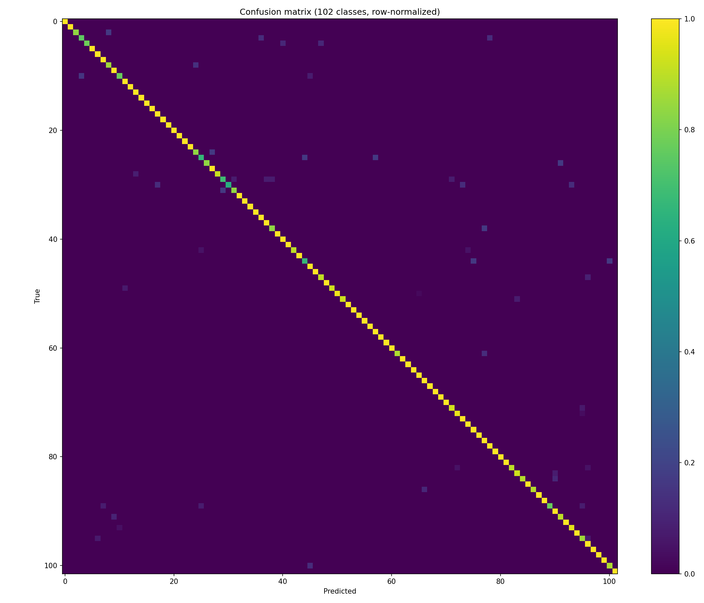

# Flower Recognition

A fine-grained flower classifier trained on the [Oxford 102 Flowers](https://www.robots.ox.ac.uk/~vgg/data/flowers/102/) dataset, deployed as a live web app where you can upload any flower photo and get a prediction.

**Live demo**: _TODO — add the `*.vercel.app` URL after deploying_


<!-- TODO: replace with a real screenshot/GIF of the deployed app once the model is trained and deployed -->

## Why this project

Most flower-classification tutorials use the 5-class "tf_flowers" dataset — a weekend toy problem. This project instead fine-tunes on **Oxford 102 Flowers**, a 102-class fine-grained benchmark actually used in computer vision research, and ships it as a real deployed inference API rather than stopping at a notebook.

## How it works

1. **Data**: Oxford 102 Flowers (8,189 images, 102 species). The official split is an inverted few-shot protocol (1,020 train images, 6,149 test images) meant for literature comparisons — not for training the best classifier possible. This project merges all splits and cuts its own stratified 70/15/15 split instead. See [`training/dataset.py`](training/dataset.py).
2. **Model**: an ImageNet-pretrained **EfficientNetB0** (via [`timm`](https://github.com/huggingface/pytorch-image-models)), fine-tuned in two stages — classifier-head warm-up with the backbone frozen, then a full unfreeze at a lower, cosine-annealed learning rate. See [`training/train.py`](training/train.py).
3. **Evaluation**: top-1/top-5 test accuracy, a full per-class precision/recall/F1 report, a confusion-matrix heatmap, a "most confused pairs" table, and Grad-CAM visualizations for interpretability. See [`training/evaluate.py`](training/evaluate.py), [`training/grad_cam.py`](training/grad_cam.py), and [results](docs/results.md).
4. **Export**: the fine-tuned model is exported to ONNX and checked for numerical parity against the original PyTorch model before being trusted in production. See [`training/export_onnx.py`](training/export_onnx.py).
5. **Serving**: a Next.js frontend and a Python [Vercel Function](https://vercel.com/docs/functions) (using `onnxruntime`, not full PyTorch, to keep the deployed bundle small) — both on Vercel's free Hobby tier. See [`app/`](app) and [`api/predict.py`](api/predict.py).

Training happens on Google Colab's free T4 GPU (see [`notebooks/train_flowers102.ipynb`](notebooks/train_flowers102.ipynb)) — this whole project runs on free tiers end to end.

## Results

_TODO — fill in after running the training notebook. Full report: [docs/results.md](docs/results.md)._

| Model | Top-1 accuracy | Top-5 accuracy |
|---|---|---|
| EfficientNetB0 (fine-tuned) | — | — |


<!-- generated by training/evaluate.py -->

## Challenges & decisions

- **Fine-grained classification is hard**: many of the 102 classes are visually similar sub-species (different lily or orchid varieties, for example), which is exactly where a generic 5-class flower classifier would never be tested. _TODO: note which classes the confusion matrix shows the model struggling with most, once trained._
- **Class imbalance**: per-class image counts in the merged dataset range from roughly 40 to 250+. The EDA cell in the training notebook surfaces this explicitly rather than hiding it.
- **Deliberately deviating from the official split**: see "How it works" above — using the paper's few-shot split would have produced a worse classifier for this project's actual goal.
- **ONNX export parity**: `export_onnx.py` doesn't just export — it asserts the exported model's outputs match the original PyTorch model's before writing `class_names.json`, so a silent export bug can't make it to production.
- **Known limitation**: _TODO — after deploying, try a few out-of-dataset photos (different lighting, background clutter, a flower photographed at an odd angle) and document at least one real failure mode here._

## Running it yourself

### Train the model (free, via Colab)

1. Push this repo to GitHub.
2. Open [`notebooks/train_flowers102.ipynb`](notebooks/train_flowers102.ipynb) in [Google Colab](https://colab.research.google.com/), set the runtime to a T4 GPU, and update `REPO_URL` in the first cell.
3. Run all cells. This downloads the dataset, trains, evaluates, and exports `api/model/flower_model.onnx` + `api/model/class_names.json`.
4. Commit and push the generated files (the notebook's last cell shows the exact commands).

If Colab's free GPU quota is throttled on a given day, [Kaggle Notebooks](https://www.kaggle.com/code) gives 30 free GPU-hours/week as a backup — the training scripts are plain PyTorch and work identically there.

### Run the web app locally

```bash
npm install
npm run dev
```

Opens at `http://localhost:3000`. Note: the Python API function (`api/predict.py`) only runs under `vercel dev` or an actual Vercel deployment, not under plain `next dev` — see [Vercel's Python runtime docs](https://vercel.com/docs/functions/runtimes/python).

### Deploy

Import the repo into [Vercel](https://vercel.com/new) — it auto-detects the Next.js app and the Python function under `api/`. Requires `api/model/flower_model.onnx` and `api/model/class_names.json` to exist (i.e., the training notebook must have been run and its output committed first). Deploys to a free `*.vercel.app` subdomain.

## Tech stack

- **Training**: PyTorch, [`timm`](https://github.com/huggingface/pytorch-image-models), scikit-learn, [pytorch-grad-cam](https://github.com/jacobgil/pytorch-grad-cam) — run on Google Colab's free T4 GPU
- **Serving**: ONNX Runtime (Python), Next.js 16 / React 19 / Tailwind CSS
- **Hosting**: Vercel (Hobby/free tier)

## License

[MIT](LICENSE)
